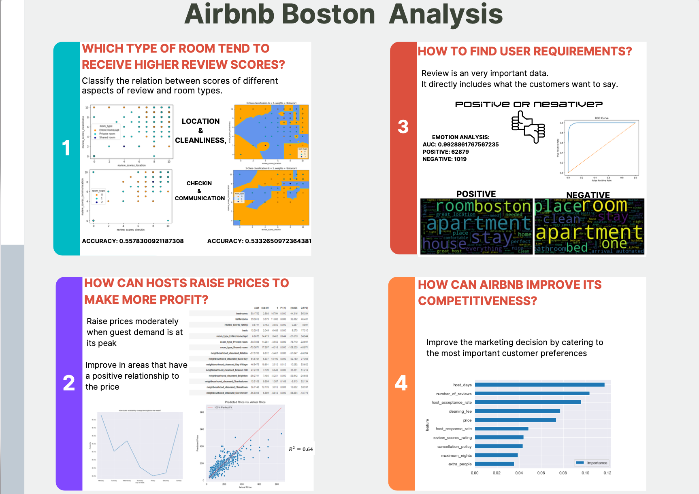
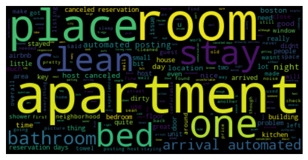
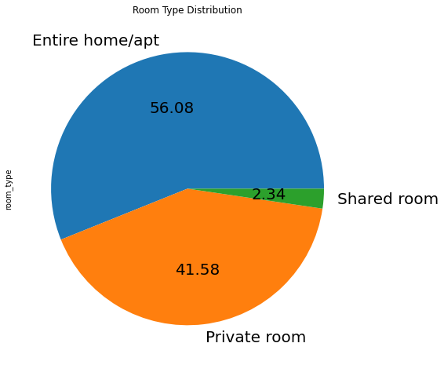
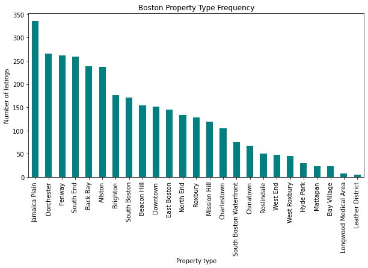
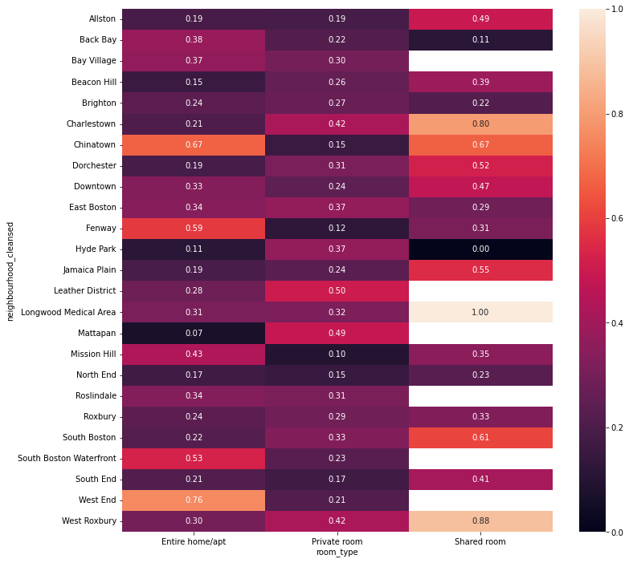
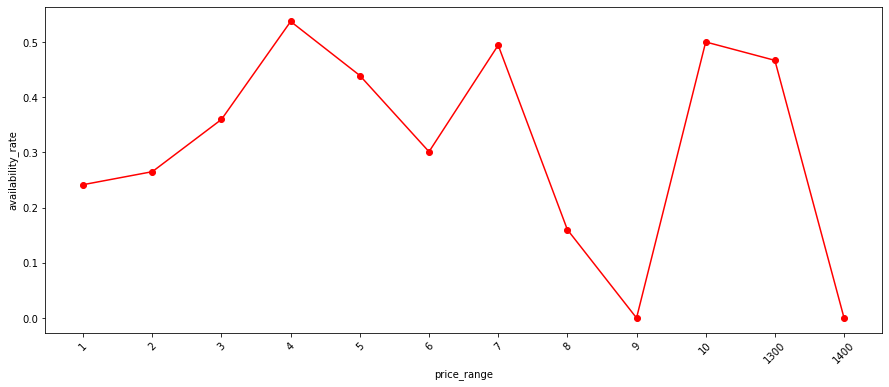
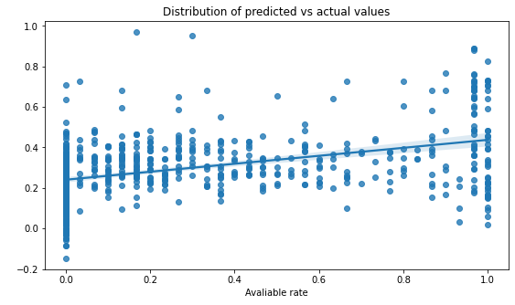
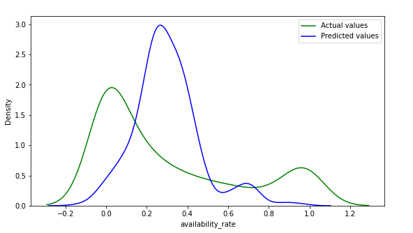

# Airbnb Data Mining Project

## Project Overview
This project focuses on data mining and predictive analytics using big data and machine learning techniques to analyze Airbnb listings. The objective is to uncover patterns in pricing, availability, and host behaviors while predicting availability rates based on key listing attributes.\

Link to Google Colab:
[# Boston Airbnb Listings Analysis](https://colab.research.google.com/drive/1mSjODaqUrfoR2oa9FNJoJ1aQ4A8WhPXg?usp=sharing)

## Visualizations

